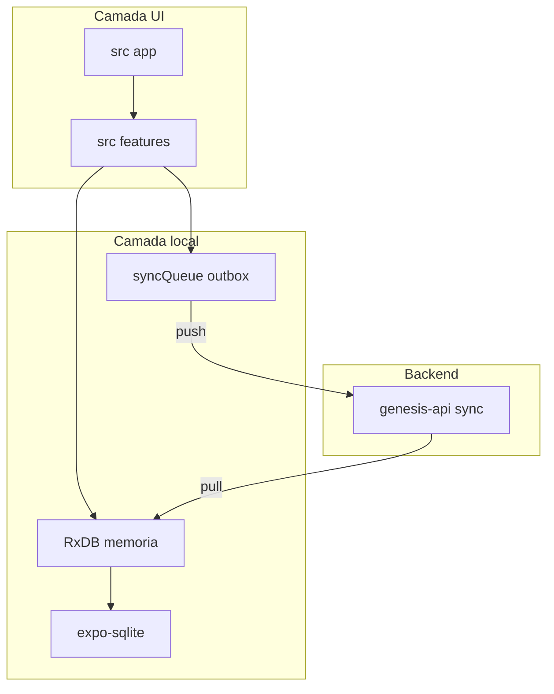
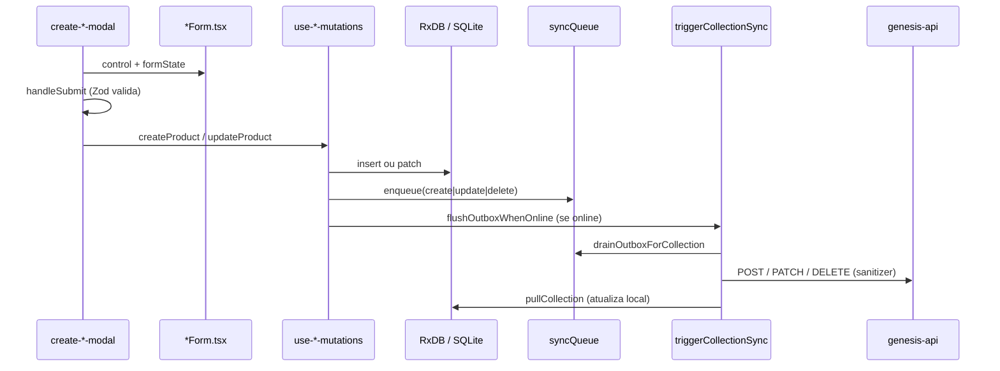

# Genesis Mobile

Aplicativo base da Epicora. Suas principais features são o Local First com [RxDB](https://rxdb.info/) e comunicação PULL e PUSH com Genesis API, módulo de temas adaptado para tokens do [Tweakcn](https://tweakcn.com) e componentes adapdatos do [React Native Reusables](https://reactnativereusables.com/).

## Guia de contribuição

Antes de implementar uma funcionalidade, verifique se ela já está contemplada na base: módulos **filme**, **usuário**, **produtora**, **perfil**, **dashboard**, **busca** e **cidades**.

- **Telas finas** em `src/app/` — apenas composição, navegação e layout
- **Lógica de domínio** em `src/features/` — hooks, componentes, sync adapters, utils
- **Local-first** — leituras via RxDB reativo; escritas em SQLite + outbox; sync em background quando online
- **Tema** — cores e tokens em `src/global.css`;
- **Formulários** — React Hook Form + Zod;

## Padrão de commit

Utilize o padrão [Conventional Commits](https://www.conventionalcommits.org/):

```
feat: adiciona funcionalidade
fix: corrige bug
refactor: refatoração
chore: alterações de CI
docs: documentação
test: testes
style: estilos
perf: performance
build: configuração de build
```

## Setup

Instale e rode:

```bash
pnpm install    # postinstall + theme:sync
pnpm start      # Metro
pnpm ios        # ou pnpm android

npx expo run:ios # para compilar os binários
```

Faça login com as mesmas credenciais do admin web. O app hidrata o banco local (SQLite) e sincroniza quando estiver online.

## Comandos


| Comando           | Uso                                                        |
| ----------------- | ---------------------------------------------------------- |
| `pnpm install`    | Dependências + postinstall (patch CSS interop + sync tema) |
| `pnpm start`      | Metro / Expo dev server                                    |
| `pnpm ios`        | Dev build iOS                                              |
| `pnpm android`    | Dev build Android                                          |
| `pnpm web`        | Target web                                                 |
| `pnpm lint`       | ESLint via Expo                                            |
| `pnpm theme:sync` | Regenera `src/constants/theme.ts` a partir de `global.css` |


### Builds (EAS)

Perfis em `[eas.json](./eas.json)`: `development` (dev client), `preview` (internal), `production`.

## Stack

**→ Package Manager**

- [pnpm](https://pnpm.io/) — cache compartilhado entre projetos do monorepo

**→ Core**

- [React 19](https://react.dev/)
- [React Native 0.83](https://reactnative.dev/)
- [TypeScript 5.9](https://www.typescriptlang.org/)
- [Expo SDK 55](https://docs.expo.dev/)

**→ Roteamento**

- [Expo Router](https://docs.expo.dev/router/introduction/) — file-based routing, typed routes

**→ Navegação**

- [React Navigation](https://reactnavigation.org/) + NativeTabs (`expo-router/unstable-native-tabs`)

**→ Estado local e sync**

- [RxDB](https://rxdb.info/) — coleções reativas em memória
- [expo-sqlite](https://docs.expo.dev/versions/latest/sdk/sqlite/) — persistência local (`genesis_local.db`)
- [Zustand](https://zustand.docs.pmnd.dev/) — JWT em `expo-secure-store`
- Outbox customizado + [@react-native-community/netinfo](https://github.com/react-native-netinfo/react-native-netinfo)

**→ Formulários**

- [React Hook Form](https://react-hook-form.com/) + [Zod](https://zod.dev/) + [@hookform/resolvers](https://github.com/react-hook-form/resolvers) — ver [Formulários](#formulários-react-hook-form--zod)

**→ HTTP**

- [Axios](https://axios-http.com/)

**→ Estilização**

- [NativeWind v4](https://www.nativewind.dev/) + [Tailwind CSS 3](https://tailwindcss.com/)
- Componentes no estilo [shadcn/ui](https://ui.shadcn.com/) (`[components.json](./components.json)`)
- [class-variance-authority](https://cva.style/), [clsx](https://github.com/lukeed/clsx), [tailwind-merge](https://github.com/dcastil/tailwind-merge), [tailwindcss-animate](https://github.com/jamiebuilds/tailwindcss-animate)

**→ Ícones**

- [Lucide React Native](https://lucide.dev/)

**→ Gráficos**

- [react-native-gifted-charts](https://github.com/Abhinandan-Kushwaha/react-native-gifted-charts)

**→ Mídia**

- [expo-image](https://docs.expo.dev/versions/latest/sdk/image/), [expo-image-picker](https://docs.expo.dev/versions/latest/sdk/imagepicker/)

**→ Animações**

- [react-native-reanimated](https://docs.swmansion.com/react-native-reanimated/), [react-native-gesture-handler](https://docs.swmansion.com/react-native-gesture-handler/)

**→ Lint**

- [ESLint 9](https://eslint.org/) + [eslint-config-expo](https://docs.expo.dev/guides/using-eslint/)

---

## Arquitetura




Fluxo resumido (se o diagrama acima não renderizar no seu viewer):

```
src/app → src/features → RxDB ↔ SQLite
                      ↘ outbox → genesis-api (push)
                      genesis-api (pull) → RxDB
```


| Pasta                | Responsabilidade                                     |
| -------------------- | ---------------------------------------------------- |
| `src/app/`           | Rotas Expo Router (auth, tabs, modals)               |
| `src/features/`      | Domínio: hooks, components, db adapters, utils       |
| `src/db/`            | Schemas RxDB, SQLite persistence, `DatabaseProvider` |
| `src/sync/`          | Pull, push, outbox, network monitor                  |
| `src/components/ui/` | Design system compartilhado                          |
| `src/common/`        | API client, config, types, utils                     |


### Roteamento

```
/                           → auth gate (hydrate JWT → redirect)
/(auth)/sign-in
/(app)/(tabs)/index         → Dashboard
/(app)/(tabs)/users|movies|producers
/(app)/(tabs)/search/
/(app)/(modals)/*           → create, detail, filters, export, profile
/debug-database
```

**Layouts:** `src/app/_layout.tsx` (DB + tema) → `(auth)` → `(app)` (+ `SyncRunner`) → `(tabs)` / modals.

**Filtros:** o modal de filtros escreve params na URL; a tab registra um listener (`register*FiltersApply`) para receber os filtros aplicados. Ex.: `src/features/users/utils/user-filters-navigation.ts`.

---

## Sync e comportamento offline

- **Escritas offline** — insert/patch local → fila `syncQueue` → push quando houver rede
- **Sync automático** — ao conectar e a cada 30 min (`src/sync/network-monitor.ts`)
- **Soft delete** — `deletedAt` no documento; remoção física após sync
- **Pull-only** — `cities` e `dashboard` (dados de referência / agregados do servidor)
- **Export** — requer conexão (`useIsOnline`); chama `GET /:origin/export` na API
- **Perfil** — REST direto (`/auth/authenticated-user`), não passa pelo RxDB

Ordem de pull (dependências): `cities` → `users` → `producers` → `movies` → `dashboard`.

---

## Autenticação

- JWT em `expo-secure-store` via `src/features/auth/auth-store.ts`
- Gate em `src/app/index.tsx` — hidrata token → `/(auth)/sign-in` ou `/(app)`
- Logout — para sync, limpa token e reseta o banco local

---

## Formulários (React Hook Form + Zod)

Todos os formulários do app usam **[React Hook Form](https://react-hook-form.com/)** com validação **[Zod](https://zod.dev/)** via `@hookform/resolvers`. Não há Formik, Yup ou validação manual em `useState`.

### Arquivos e responsabilidades


| Caminho                                         | Função                                                                           |
| ----------------------------------------------- | -------------------------------------------------------------------------------- |
| `src/components/ui/form/use-zod-form.ts`        | Wrapper de `useForm` + `zodResolver`                                             |
| `src/components/ui/form/`                       | Campos reutilizáveis (`FormInput`, `FormDatePicker`, `AvatarField`, …)           |
| `src/common/utils/zod.ts`                       | Helpers compartilhados (`requiredStringValidation`, `emptyToUndefined`, CNPJ, …) |
| `src/common/types/form.ts`                      | Tipo `FormProps<T>` (`control`, `formState`, `register`, `setValue`)             |
| `src/features/<modulo>/api/*-schemas.ts`        | Schemas Zod de create/edit                                                       |
| `src/features/<modulo>/api/*-filter-schemas.ts` | Schemas Zod de filtros (campos opcionais)                                        |
| `src/features/<modulo>/components/*-form.tsx`   | Layout de campos do domínio                                                      |
| `src/app/` e filter sheets                      | Orquestração: `useZodForm`, submit, navegação                                    |


### `useZodForm`

```typescript
import { useZodForm } from "@/components/ui/form";
import { userSchema, type UserSchema } from "@/features/users/api/user-schemas";

const { control, handleSubmit, formState, reset, register } =
  useZodForm<UserSchema>({
    schema: userSchema,
    defaultValues: { fullName: "", email: "", role: Role.USER },
  });
```

- Modo padrão: `onBlur`.
- Tipagem inferida com `z.infer<typeof schema>`.
- Em edição, chame `reset(doc)` quando o RxDB carregar o documento.

### Schema Zod

Defina o contrato do formulário em `src/features/<modulo>/api/`:

```typescript
import { requiredStringValidation } from "@/common/utils/zod";
import { z } from "zod";

export const userSchema = z.object({
  fullName: requiredStringValidation({ min: 2 }),
  email: requiredStringValidation().email({ message: "E-mail inválido" }),
  role: z.nativeEnum(Role, { message: "Selecione um cargo" }),
  avatarUrl: z.string().optional(),
});

export type UserSchema = z.infer<typeof userSchema>;
```

- Use `requiredStringValidation()` para campos obrigatórios com mensagens em português.
- Use `emptyToUndefined` + `z.preprocess` em schemas de **filtro** para strings vazias virarem `undefined`.
- Transformações (máscaras, dígitos) ficam no schema com `.transform()` / `.refine()`.

### Componentes de campo

Exportados em `@/components/ui/form`:


| Componente                           | Uso                             |
| ------------------------------------ | ------------------------------- |
| `FormInput`                          | Texto, e-mail, senha, multiline |
| `FormDatePicker` / `DatePickerInput` | Datas                           |
| `FormChips`                          | Enums / opções fixas            |
| `AvatarField`                        | Upload de avatar                |
| `ControlledQuerySelect`              | Select com busca (ex.: cidade)  |
| `FilterDateRange`                    | Intervalo de datas em filtros   |
| `FormField` / `FormError`            | Label e mensagem de erro        |


Todos recebem `control` + `name` do React Hook Form e exibem `formState.errors`.

### Form de domínio

O componente `*Form.tsx` só renderiza campos — sem submit nem navegação:

```typescript
type UserFormProps = FormProps<UserSchema> & { disabled?: boolean };

export function UserForm({ control, formState, disabled }: UserFormProps) {
  const { errors } = formState;
  return (
    <FormInput
      control={control}
      name="fullName"
      label="Nome completo*"
      placeholder="Digite o nome completo"
      error={errors.fullName}
      editable={!disabled}
    />
  );
}
```

Use `useWatch` quando um campo depende de outro (ex.: iniciais do avatar a partir do nome).

### Onde cada padrão aparece


| Fluxo               | Schema                                  | Tela / componente                   |
| ------------------- | --------------------------------------- | ----------------------------------- |
| Login / reset senha | `src/features/auth/api/auth-schemas.ts` | `sign-in.tsx`, `reset-password.tsx` |
| CRUD create/edit    | `*-schemas.ts`                          | `create-*-modal.tsx` + `*-form.tsx` |
| Perfil              | `profile-schemas.ts`                    | `edit-profile-modal.tsx`            |
| Filtros de lista    | `*-filter-schemas.ts`                   | `*-filter-sheet.tsx`                |


Referências completas: `create-user-modal.tsx` + `user-form.tsx`, `create-producer-modal.tsx` + `producer-form.tsx`, `users-filter-sheet.tsx`.

Para o fluxo CRUD completo (create/edit + onde entra o sync), veja [Como criar um novo módulo CRUD](#como-criar-um-novo-módulo-crud) — passos 12–13 e 8.

### Submit no modal

```typescript
const onSubmit = handleSubmit(async (values) => {
  setIsSubmitting(true);
  try {
    await createProduct(values);
    router.back();
  } catch (e) {
    setSubmitError(/* mensagem */);
  } finally {
    setIsSubmitting(false);
  }
});
```

Mapeie o shape flat do formulário para o documento RxDB no modal (ex.: `cityId` → `address.city` em produtoras) **antes** de chamar a mutation.

---

## Como criar um novo módulo CRUD

Cada entidade (usuário, filme, produto…) segue o mesmo fluxo: **a UI lê e escreve no RxDB local**; o sync conversa com a API em segundo plano. Use `**users`**, `**movies`** e `**producers**` como referência real.

**Regra de ouro:** a tela nunca chama a API direto para listar ou salvar CRUD — ela usa hooks que falam com o banco local. A API entra só no pull (baixar) e no push (enviar fila).

### Fluxo completo: formulário → RxDB → API




**Quem faz o quê:**


| Camada                       | Responsabilidade                                 | Chama sync/API?                   |
| ---------------------------- | ------------------------------------------------ | --------------------------------- |
| `*Form.tsx`                  | Renderiza campos                                 | Não                               |
| `create-*-modal.tsx`         | Valida (Zod), mapeia valores, chama mutation     | Não                               |
| `use-*-mutations.ts`         | Grava RxDB + enfileira + dispara sync da coleção | Sim (via `triggerCollectionSync`) |
| `SyncRunner` (`use-sync.ts`) | Sync global ao conectar / a cada 30 min          | Sim (todas as coleções)           |


O formulário **nunca** importa `@/sync` nem `api-client` para CRUD. Toda comunicação com o servidor passa pela fila de outbox.

### Visão geral (o que você vai criar)


| Camada              | O que é                                                | Por quê existe                                                                               |
| ------------------- | ------------------------------------------------------ | -------------------------------------------------------------------------------------------- |
| Schema + `db/index` | Formato do documento no dispositivo                    | RxDB precisa saber campos e tipos para validar e persistir no SQLite                         |
| `endpoints.ts`      | Slug da coleção na API (`products` → `/sync/products`) | Centraliza o nome usado no pull e no push                                                    |
| **Normalizer**      | API → celular (no **pull**)                            | A resposta do servidor pode vir com formatos diferentes (Date, campos extras, `id` vs `_id`) |
| **Sanitizer**       | Celular → API (no **push**)                            | O documento local pode ter campos que o servidor não aceita; enviamos só o necessário        |
| Hooks               | Leitura/escrita reativa + fila                         | UI atualiza sozinha quando o banco muda; offline enfileira e sync depois                     |
| `src/app/`          | Telas e modals                                         | Só navegação e composição — sem regra de negócio pesada                                      |


### Normalizer e Sanitizer (leia antes dos passos 4 e 5)

São adaptadores **por entidade**, em `src/features/<modulo>/db/`.

**Normalizer (pull)** — roda quando o app **baixa** dados (`GET /sync/products`).

- A API devolve JSON “como o backend guarda”.
- O celular guarda um formato **fixo** (`ProductDoc`): `_id` string, datas em ISO, campos obrigatórios sempre preenchidos.
- `buildNormalizedBase()` já trata `_id`, `createdAt`, `updatedAt` e `deletedAt` para todas as coleções.
- Você só mapeia os campos **específicos** da entidade (`name`, `price`, etc.) e trata `null`/tipos estranhos com `??` e `Number()`.

**Sanitizer (push)** — roda quando o app **envia** da fila (`POST`/`PATCH` no sync).

- O RxDB pode ter o documento **inteiro** (incluindo coisas que o POST não deve receber).
- O sanitizer monta um objeto **mínimo**: só os campos que a API espera naquele `create` ou `update`.
- No `create`, costuma incluir `_id` — o app gera o ObjectId no cliente para funcionar offline; o servidor grava o mesmo id.
- Em entidades com referência (ex.: filme → produtora), use `refToId()` para mandar só o `_id` string, não o objeto populado. Ver `movies.sanitizer.ts`.

Resumindo: **normalizer = tradutor na entrada** · **sanitizer = filtro na saída**.

### Estrutura de pastas

Para um módulo `products` (exemplo):

```
src/db/schemas/product.schema.ts
src/features/products/
  ├── api/
  │   ├── product-schemas.ts          # Zod create/edit
  │   └── product-filter-schemas.ts   # Zod filtros
  ├── db/
  │   ├── products.normalizer.ts
  │   └── products.sanitizer.ts
  ├── hooks/
  │   ├── use-products-infinite.ts
  │   ├── use-product.ts
  │   └── use-products-mutations.ts   # RxDB + outbox + sync
  ├── components/
  │   ├── product-form.tsx            # só campos
  │   ├── product-card.tsx
  │   └── products-filter-sheet.tsx
  └── utils/
      ├── product-filters-params.ts
      ├── product-filters-navigation.ts
      ├── match-product-filters.ts
      └── product-filters-export.ts
src/app/(app)/(tabs)/products.tsx
src/app/(app)/(modals)/create-product-modal.tsx   # create + edit (mesmo arquivo)
src/app/(app)/(modals)/product-modal.tsx          # detalhe (somente leitura)
src/app/(app)/(modals)/product-filters.tsx
```

### Passo a passo

#### 1. Schema RxDB — `src/db/schemas/product.schema.ts`

Define o **contrato do documento no dispositivo**. O RxDB usa isso para validar inserts e para o TypeScript nos hooks.

- `_id` é a chave primária (ObjectId em hex, gerado no app).
- `createdAt` / `updatedAt` são obrigatórios — toda mutação local atualiza `updatedAt`.
- `deletedAt` opcional — exclusão é **soft delete** (marca e sync depois), não apaga o registro na hora.

```typescript
import type { RxJsonSchema } from "rxdb";

export type ProductDoc = {
  _id: string;
  name: string;
  price: number;
  category: string;
  createdAt: string;
  updatedAt: string;
  deletedAt?: string;
};

export const productSchema: RxJsonSchema<ProductDoc> = {
  version: 0,
  primaryKey: "_id",
  type: "object",
  properties: {
    _id: { type: "string", maxLength: 100 },
    name: { type: "string" },
    price: { type: "number" },
    category: { type: "string" },
    createdAt: { type: "string" },
    updatedAt: { type: "string" },
    deletedAt: { type: "string" },
  },
  required: ["_id", "name", "price", "category", "createdAt", "updatedAt"],
};
```

#### 2. Registrar coleção — `src/db/index.ts`

Sem este passo o RxDB não cria a coleção `products` na abertura do app. A persistência em SQLite já é genérica: ao registrar em `COLLECTIONS`, cada insert/update também vai para o disco.

```typescript
import { productSchema, type ProductDoc } from "./schemas/product.schema";

export type DatabaseCollections = {
  // ...existentes
  products: RxCollection<ProductDoc>;
};

export const COLLECTIONS = [
  // ...existentes
  { name: "products", schema: productSchema },
];
```

#### 3. Endpoint de sync — `src/sync/endpoints.ts`

Liga o **nome interno** (`products`) ao **slug da API** (`/sync/products`). O sync não adivinha URLs.

`PULL_COLLECTION_ORDER` define a ordem do download: coleções que outras referenciam devem vir antes (ex.: `producers` antes de `movies`). Só inclua `products` aqui se a API fizer pull dessa coleção.

```typescript
export const COLLECTION_ENDPOINTS = {
  // ...existentes
  products: { sync: "products" },
};

export const PULL_COLLECTION_ORDER: CollectionName[] = [
  "cities",
  "users",
  "producers",
  "movies",
  "products", // posição conforme dependências da API
  "dashboard",
];
```

#### 4. Normalizer (pull) — `src/features/products/db/products.normalizer.ts`

Chamado automaticamente no pull, antes de salvar no RxDB. Se faltar, o sync usa o JSON bruto e você pode ter `_id` inconsistente ou campos `undefined` que quebram a UI.

```typescript
import { buildNormalizedBase } from "@/sync/pull/base-fields";
import type { LocalDoc } from "@/sync/pull/base-fields";

export function normalizeProduct(raw: Record<string, any>): LocalDoc {
  return {
    ...buildNormalizedBase(raw), // _id, datas ISO, deletedAt
    name: raw.name ?? "",
    price: Number(raw.price ?? 0), // API pode mandar string
    category: raw.category ?? "",
  };
}
```

Registre em `src/sync/pull/normalizers.ts` — o mapa `PULL_NORMALIZERS` é o “índice” que o sync consulta pelo nome da coleção.

#### 5. Sanitizer (push) — `src/features/products/db/products.sanitizer.ts`

Chamado no push, **depois** de ler o payload da fila. Evita mandar campos extras que geram 400 na API.

- Só copie campos que existem (`if (p.name !== undefined)`).
- `_id` no `create`: o servidor precisa aceitar o id gerado no celular.
- Não envie `createdAt`/`updatedAt` no sanitizer **a menos** que a API espere — no exemplo de usuários, muitas vezes só vão os campos editáveis.

```typescript
export function sanitizeProduct(
  payload: Record<string, unknown>,
  operation: "create" | "update",
): Record<string, unknown> {
  const out: Record<string, unknown> = {};
  const p = payload as any;
  if (p.name !== undefined) out.name = p.name;
  if (p.price !== undefined) out.price = p.price;
  if (p.category !== undefined) out.category = p.category;
  if (operation === "create" && p._id !== undefined) out._id = p._id;
  return out;
}
```

Registre em `src/sync/push/sanitizers.ts` (`PUSH_SANITIZERS`).

#### 6. Hook de listagem — `use-products-infinite.ts`

**Por que subscribe e não `fetch` da API?** A lista deve funcionar offline e reagir a mudanças (você criou um item → a lista atualiza sem refetch manual).

- `.find({ selector: { deletedAt: { $exists: false } } })` — esconde itens excluídos localmente.
- `matchesProductFilters` — filtros rodam no celular (dados já estão no RxDB).
- `loadedLimit` + `fetchNextPage` — “paginação” por janela, sem pedir página 2 ao servidor.

Referência real: `src/features/users/hooks/use-users-infinite.ts`.

```typescript
import { useCallback, useEffect, useMemo, useState } from "react";
import { useDatabase } from "@/db/use-db";
import type { ProductDoc } from "@/db/schemas/product.schema";
import type { ProductFilters } from "@/features/products/components/products-filter-sheet";
import { matchesProductFilters } from "@/features/products/utils/match-product-filters";

const DEFAULT_PAGE_SIZE = 20;

export type UseProductsInfiniteOptions = {
  pageSize?: number;
} & ProductFilters;

export function useProductsInfinite(options: UseProductsInfiniteOptions = {}) {
  const { pageSize: pageSizeOption, name, category /* ...filtros */ } = options;
  const pageSize = pageSizeOption ?? DEFAULT_PAGE_SIZE;

  const filters = useMemo(
    () => ({ name, category /* ... */ }),
    [name, category /* ... */],
  );
  const filtersKey = useMemo(() => JSON.stringify(filters), [filters]);
  const { db, isReady } = useDatabase();

  const [products, setProducts] = useState<ProductDoc[]>([]);
  const [loadedLimit, setLoadedLimit] = useState(pageSize);
  const [isLoading, setIsLoading] = useState(true);
  const [isFetchingNextPage, setIsFetchingNextPage] = useState(false);
  const [hasNextPage, setHasNextPage] = useState(false);

  // Reseta a janela quando filtros ou pageSize mudam
  useEffect(() => {
    setLoadedLimit(pageSize);
    setProducts([]);
    setIsLoading(true);
    setIsFetchingNextPage(false);
    setHasNextPage(false);
  }, [filtersKey, pageSize]);

  // Subscribe reativo — reexecuta quando RxDB muda ou loadedLimit cresce
  useEffect(() => {
    if (!db || !isReady) return;

    const subscription = (db.products as any)
      .find({
        selector: { deletedAt: { $exists: false } },
        sort: [{ name: "asc" }],
      })
      .$.subscribe((docs: any[]) => {
        const json = docs
          .map((d) => d.toJSON() as ProductDoc)
          .filter((product) => matchesProductFilters(product, filters));

        setProducts(json.slice(0, loadedLimit));
        setHasNextPage(json.length > loadedLimit);
        setIsLoading(false);
        setIsFetchingNextPage(false);
      });

    return () => subscription.unsubscribe();
  }, [db, isReady, loadedLimit, filtersKey, filters]);

  const fetchNextPage = useCallback(() => {
    if (!hasNextPage || isFetchingNextPage || isLoading) return;
    setIsFetchingNextPage(true);
    setLoadedLimit((n) => n + pageSize);
  }, [hasNextPage, isFetchingNextPage, isLoading, pageSize]);

  return {
    products,
    isLoading,
    isFetchingNextPage,
    hasNextPage,
    fetchNextPage,
  };
}
```

Uso na tab:

```typescript
const { products, isLoading, fetchNextPage, hasNextPage, isFetchingNextPage } =
  useProductsInfinite({ name: filters.name, category: filters.category });

<FlatList
  data={products}
  onEndReached={() => hasNextPage && fetchNextPage()}
  ListFooterComponent={isFetchingNextPage ? <ActivityIndicator /> : null}
/>
```

#### 7. Hook de item — `use-product.ts`

Um `findOne` reativo por `_id` para modals de detalhe/edição. Quando o sync traz alterações do servidor, o modal reflete sozinho.

Referência real: `src/features/users/hooks/use-user.ts`.

```typescript
import { useEffect, useState } from "react";
import { useDatabase } from "@/db/use-db";
import type { ProductDoc } from "@/db/schemas/product.schema";

export function useProduct(id: string | undefined) {
  const { db, isReady } = useDatabase();
  const [product, setProduct] = useState<ProductDoc | null>(null);
  const [isLoading, setIsLoading] = useState(true);

  useEffect(() => {
    if (!db || !isReady || !id) {
      setProduct(null);
      setIsLoading(false);
      return;
    }

    setIsLoading(true);

    const subscription = (db.products as any)
      .findOne({ selector: { _id: id } })
      .$.subscribe((doc: any) => {
        setProduct(doc ? (doc.toJSON() as ProductDoc) : null);
        setIsLoading(false);
      });

    return () => subscription.unsubscribe();
  }, [db, isReady, id]);

  return { product, isLoading };
}
```

Uso no modal de edição:

```typescript
const { productId } = useLocalSearchParams<{ productId?: string }>();
const { product, isLoading } = useProduct(productId);

useEffect(() => {
  if (!product) return;
  reset({
    name: product.name,
    price: product.price,
    category: product.category,
  });
}, [product, reset]);
```

#### 8. Hook de mutations — `use-products-mutations.ts`

Este é o **único lugar** onde create/edit/delete tocam o RxDB e disparam sync. O modal só chama funções deste hook.

**Ordem obrigatória em toda operação:**

1. **Gravar local** (`insert` / `patch`) — o usuário vê o resultado na hora, mesmo offline.
2. `**enqueue` — grava entrada na coleção `syncQueue` (`create`, `update` ou `delete` + payload).
3. `**flush*OutboxWhenOnline` — se houver rede, chama `triggerCollectionSync(db, "products")`.

**Delete:** não remove o doc; faz `patch({ deletedAt })` + `enqueue` com operação `delete`. A lista filtra `deletedAt` ausente.

```typescript
import NetInfo from "@react-native-community/netinfo";
import { enqueue } from "@/sync/outbox";
import { triggerCollectionSync } from "@/sync/network-monitor";
import { generateObjectIdHex } from "@/common/utils/id";

async function flushProductsOutboxWhenOnline(db: AppDatabase, context: string) {
  const net = await NetInfo.fetch();
  if (!net.isConnected || net.isInternetReachable === false) return;
  try {
    await triggerCollectionSync(db, "products");
  } catch (e) {
    console.error(`[sync] products collection sync ${context} failed`, e);
  }
}

// CREATE
const _id = generateObjectIdHex();
const now = new Date().toISOString();
const doc = { _id, ...input, createdAt: now, updatedAt: now };
await db.products.insert(doc);
await enqueue(db, {
  collectionName: "products",
  docId: _id,
  operation: "create",
  payload: doc,
});
await flushProductsOutboxWhenOnline(db, "after create");

// UPDATE
await existing.patch({ ...input, updatedAt });
await enqueue(db, {
  collectionName: "products",
  docId: id,
  operation: "update",
  payload: { ...existing.toJSON(), ...input, updatedAt },
});
await flushProductsOutboxWhenOnline(db, "after update");
```

Referência completa: `src/features/users/hooks/use-users-mutations.ts`.

Estrutura do hook exportado:

```typescript
export function useProductsMutations() {
  const { db } = useDatabase();

  const createProduct = useCallback(
    async (input: CreateProductInput) => {
      /* insert → enqueue → flushProductsOutboxWhenOnline */
    },
    [db],
  );

  const updateProduct = useCallback(
    async (id: string, input: UpdateProductInput) => {
      /* patch → enqueue → flushProductsOutboxWhenOnline */
    },
    [db],
  );

  const deleteProduct = useCallback(
    async (id: string) => {
      /* patch deletedAt → enqueue delete → flushProductsOutboxWhenOnline */
    },
    [db],
  );

  return { createProduct, updateProduct, deleteProduct };
}
```

##### O que `triggerCollectionSync` faz

Definido em `src/sync/network-monitor.ts`. Para **uma coleção**:

1. `drainOutboxForCollection` — processa a fila local (`syncQueue`).
2. Para cada entrada: `pushDocument` → aplica **sanitizer** → `POST` / `PATCH` / `DELETE` na API.
3. `pullCollection` — baixa alterações do servidor e grava no RxDB (via **normalizer**).

##### Sync em background (sem passar pelo modal)

Além do flush imediato após cada mutation, o app sincroniza automaticamente:


| Gatilho                        | Onde                                                        | O que roda                           |
| ------------------------------ | ----------------------------------------------------------- | ------------------------------------ |
| App autenticado aberto         | `SyncRunner` em `src/app/(app)/_layout.tsx` → `use-sync.ts` | `startNetworkMonitor`                |
| Rede volta                     | `network-monitor.ts` (listener NetInfo)                     | `drainOutbox` + `pullAllCollections` |
| A cada 30 min (online)         | mesmo monitor                                               | sync completo                        |
| Sync manual (se exposto na UI) | `triggerManualSync`                                         | todas as coleções                    |


Se o usuário estiver **offline**, só rodam os passos 1 e 2 (RxDB + enqueue). Quando a rede voltar, o monitor drena a fila — nenhuma alteração extra no modal é necessária.

#### 9. Card e filter sheet

- `product-card.tsx` — visual de um item; recebe `ProductDoc`, sem buscar API.
- `products-filter-sheet.tsx` — define o tipo `ProductFilters` usado pelo hook e pelo modal.

#### 10. Utils de filtros


| Arquivo                         | Por quê                                                                                   |
| ------------------------------- | ----------------------------------------------------------------------------------------- |
| `product-filters-params.ts`     | Expo Router só passa **strings** entre telas; converte filtros ↔ query params             |
| `product-filters-navigation.ts` | Modal de filtro não compartilha estado com a tab; o listener devolve os filtros aplicados |
| `match-product-filters.ts`      | Regra “nome contém X” roda no array já carregado do RxDB                                  |
| `product-filters-export.ts`     | Monta JSON para o modal de exportação online                                              |


#### 11. Tab screen — `src/app/(app)/(tabs)/products.tsx`

Só orquestra: chama `useProductsInfinite`, renderiza `FlatList`, abre modals. Não duplique lógica de sync aqui.

```typescript
router.push({
  pathname: "/product-filters",
  params: productFiltersToParams(filters),
});
router.push("/create-product-modal");
router.push({ pathname: "/product-modal", params: { id: product._id } });
```

Referência: `src/app/(app)/(tabs)/users.tsx`.

#### 12. Formulário de criação

Siga estes passos na ordem. Referência: `create-user-modal.tsx` + `user-form.tsx` + `user-schemas.ts`.

##### 12.1 Schema Zod — `src/features/products/api/product-schemas.ts`

Define o shape **flat** do formulário (pode diferir do `ProductDoc` no RxDB):

```typescript
import { requiredStringValidation } from "@/common/utils/zod";
import { z } from "zod";

export const productFormSchema = z.object({
  name: requiredStringValidation({ min: 2 }),
  price: z.coerce.number().min(0, "Preço inválido"),
  category: requiredStringValidation(),
});

export type ProductFormSchema = z.infer<typeof productFormSchema>;
```

- Validação de máscara/dígitos fica no schema (`.transform()` / `.refine()`).
- Campos que existem só no documento RxDB (ex.: `status`, `createdAt`) **não** entram no schema — a mutation preenche.

##### 12.2 Componente de campos — `src/features/products/components/product-form.tsx`

Só UI de campos. Recebe `control` e `formState` via `FormProps<ProductFormSchema>`:

```typescript
import { FormInput } from "@/components/ui/form";
import type { FormProps } from "@/common/types/form";
import type { ProductFormSchema } from "@/features/products/api/product-schemas";

type ProductFormProps = FormProps<ProductFormSchema> & { disabled?: boolean };

export function ProductForm({ control, formState, disabled }: ProductFormProps) {
  const { errors } = formState;
  return (
    <>
      <FormInput
        control={control}
        name="name"
        label="Nome*"
        placeholder="Nome do produto"
        error={errors.name}
        editable={!disabled}
      />
      {/* demais campos */}
    </>
  );
}
```

##### 12.3 Modal de criação — `src/app/(app)/(modals)/create-product-modal.tsx`

Orquestra form + submit + mutation. **Não chama sync diretamente.**

```typescript
const emptyForm: ProductFormSchema = { name: "", price: 0, category: "" };

export default function CreateProductModal() {
  const { createProduct } = useProductsMutations();
  const [isSubmitting, setIsSubmitting] = useState(false);

  const { control, handleSubmit, formState, register } =
    useZodForm<ProductFormSchema>({
      schema: productFormSchema,
      defaultValues: emptyForm,
    });

  const onSubmit = handleSubmit(async (data) => {
    setIsSubmitting(true);
    try {
      // Mapeie form → input da mutation (se necessário)
      await createProduct({
        name: data.name.trim(),
        price: data.price,
        category: data.category,
      });
      router.back(); // lista atualiza sozinha via RxDB reativo
    } catch (e) {
      Alert.alert("Erro", /* mensagem */);
    } finally {
      setIsSubmitting(false);
    }
  });

  return (
    /* header + ScrollView com <ProductForm ... /> + botão Salvar chama onSubmit */
  );
}
```

##### 12.4 Abrir o modal a partir da tab

```typescript
// src/app/(app)/(tabs)/products.tsx
router.push("/create-product-modal");
```

##### 12.5 Formulário com shape aninhado (ex.: produtora)

Quando o RxDB guarda objetos aninhados (`address.city`) mas o form é flat (`cityId`), faça o mapeamento **no modal**, no `onSubmit`, antes da mutation:

```typescript
// create-producer-modal.tsx — trecho
const cityDoc = cities.find((c) => c._id === data.cityId);
const address: AddressDoc = {
  street: data.street.trim(),
  city: data.cityId,
  state: cityDoc.state,
  zipCode: data.zipCode,
  /* ... */
};
await createProducer({ name: data.name.trim(), address /* ... */ });
```

Referência: `create-producer-modal.tsx` + `producer-schemas.ts` (flat) vs `ProducerDoc` (aninhado).

---

#### 13. Formulário de edição

No projeto, **create e edit compartilham o mesmo modal**. A rota recebe um param opcional com o `_id` do documento.

##### 13.1 Navegação para editar

```typescript
// product-card.tsx ou product-modal.tsx
router.push({
  pathname: "/create-product-modal",
  params: { productId: item._id },
});
```

##### 13.2 Detectar modo edição e carregar doc

```typescript
const { productId } = useLocalSearchParams<{ productId?: string }>();
const isEditMode = Boolean(productId);
const { product, isLoading } = useProduct(isEditMode ? productId : undefined);
const { createProduct, updateProduct } = useProductsMutations();

const { control, handleSubmit, formState, reset, register } =
  useZodForm<ProductFormSchema>({
    schema: productFormSchema,
    defaultValues: emptyForm,
  });

// Quando o RxDB entregar o doc, preenche o form
useEffect(() => {
  if (!isEditMode || !product) return;
  reset({
    name: product.name,
    price: product.price,
    category: product.category,
  });
}, [isEditMode, product, reset]);
```

- `useProduct` é **reativo** — se o sync atualizar o doc enquanto o modal está aberto, o `useEffect` pode rodar de novo.
- Em edição, desabilite campos imutáveis no `*Form` (ex.: e-mail) via prop `showEmail={false}` ou `editable={false}`.

##### 13.3 Submit com branch create/update

```typescript
const onSubmit = handleSubmit(async (data) => {
  try {
    if (isEditMode && productId) {
      await updateProduct(productId, {
        name: data.name.trim(),
        price: data.price,
        category: data.category,
      });
    } else {
      await createProduct({
        /* ... */
      });
    }
    router.back();
  } catch (e) {
    /* erro */
  }
});
```

##### 13.4 Estados de loading e not found

Antes de renderizar o form, trate:

```typescript
if (isEditMode && isLoading) return <ActivityIndicator />;
if (isEditMode && !product) return <Text>Produto não encontrado.</Text>;
```

Referência completa: `create-user-modal.tsx` (param `userId`), `create-producer-modal.tsx` (param `producerId`).

##### 13.5 Detalhe vs edição


| Modal                      | Função                                | Abre edição?                                            |
| -------------------------- | ------------------------------------- | ------------------------------------------------------- |
| `product-modal.tsx`        | Somente leitura, ações (ex.: excluir) | Botão "Editar" → `create-product-modal` com `productId` |
| `create-product-modal.tsx` | Form create/edit                      | —                                                       |


---

#### 14. Modal de filtros

- `useZodForm` com schema de filtros (campos opcionais) em `*-filter-schemas.ts`.
- Submit chama `applyProductFilters()` via listener de navegação — **não** passa pelo RxDB nem sync.
- Referência: `users-filter-sheet.tsx`.

Siga também [Formulários](#formulários-react-hook-form--zod) para detalhes de campos reutilizáveis.

#### 15. Registrar modals — `src/app/(app)/_layout.tsx`

Arquivo em `(modals)/` não basta: cada rota modal precisa de `Stack.Screen` com `presentation: "modal"`, senão abre como tela cheia.

#### 16. Tab (opcional) — `src/app/(app)/(tabs)/_layout.tsx`

Só se o módulo merecer aba fixa. Caso contrário, pode viver só como atalho dentro de outra tela.

### Checklist antes de abrir PR

- Schema RxDB + `COLLECTIONS` + `COLLECTION_ENDPOINTS` + normalizer + sanitizer registrados
- `PULL_COLLECTION_ORDER` coerente com dependências na API
- Schema Zod (`*-schemas.ts`) + `*Form.tsx` + modal create/edit
- Mutations: insert/patch → `enqueue` → `flushOutboxWhenOnline`; lista ignora `deletedAt`
- Modal **não** importa sync/API — só chama hooks de mutation
- Modals registrados em `(app)/_layout.tsx`
- Metro rodando ao adicionar rotas em `src/app/`
- API com `/sync/products` (ou slug escolhido) testada com app online

---

## Tema

O app usa **NativeWind v4** + **Tailwind CSS v3**. O tema foi pensado para ser copiado em novos projetos: altere as cores **uma vez** em `global.css` e o restante do código continua usando as mesmas classes (`bg-card`, `text-primary`, etc.).

### Arquivos do tema


| Arquivo                                            | Função                                                                                  | Editar ao trocar o tema?        |
| -------------------------------------------------- | --------------------------------------------------------------------------------------- | ------------------------------- |
| `[src/global.css](src/global.css)`                 | Variáveis CSS (`:root` e `.dark:root`) — **fonte da verdade** para cores em `className` | **Sim**                         |
| `[tailwind.config.js](tailwind.config.js)`         | Conecta tokens Tailwind às variáveis (`hsl(var(--background))`, etc.)                   | Não (boilerplate)               |
| `[src/constants/theme.ts](src/constants/theme.ts)` | Cores em hex para props JS (ícones, gráficos, headers) — **gerado automaticamente**     | **Não** (use `pnpm theme:sync`) |


**O que usa cada fonte:**

- `**className` (`bg-background`, `border-border`, …) → variáveis em `global.css`
- `**color={...}`, `headerTintColor`, gráficos → `useTheme()` / `theme.ts`

### Trocar o tema em um app novo

#### 1. Edite `src/global.css`

Substitua os blocos `:root` (modo claro) e `.dark:root` (modo escuro) pelas variáveis do seu tema.

Formato esperado (canais HSL, **sem** `hsl()`):

```css
@layer base {
  :root {
    --background: 25 100% 96%;
    --foreground: 19 56% 91%;
    --card: 19 56% 91%;
    --card-foreground: 0 0% 40%;
    /* ... demais tokens ... */
    --button-primary: 0 0% 100%;
    --button-text: black;
    --radius: 12px;
  }

  .dark:root {
    --background: 204 17% 11%;
    --foreground: 0 0% 100%;
    /* ... demais tokens ... */
    --button-primary: 210 21% 15%;
    --button-text: white;
  }
}
```

> **Importante:** use `.dark:root`, não apenas `.dark { }`. O NativeWind depende desse seletor para alternar variáveis no React Native.

Mantenha as três linhas no topo do arquivo:

```css
@tailwind base;
@tailwind components;
@tailwind utilities;
```

#### 2. Sincronize `theme.ts`

```bash
pnpm theme:sync
```

Isso lê `global.css`, converte as variáveis para hex e regenera `src/constants/theme.ts`. O sync também roda no `pnpm install` (via `postinstall`).

#### 3. Reinicie o Metro

```bash
pnpm start --clear
```

### Temas do [tweakcn](https://tweakcn.com)

1. Gere o tema no tweakcn.
2. **Converta** as cores para canais HSL no formato acima, **ou** use `oklch(...)` completo na variável (o script de sync também entende `oklch`).
3. Cole em `:root` e `.dark:root` em `global.css`.
4. Troque `.dark {` por `.dark:root {` se necessário.
5. Adicione tokens extras deste app, se faltarem: `--button-primary`, `--button-text`.
6. Rode `pnpm theme:sync`.

**Tokens obrigatórios** (em `:root` e `.dark:root`): `background`, `foreground`, `card`, `card-foreground`, `popover`, `popover-foreground`, `primary`, `primary-foreground`, `secondary`, `secondary-foreground`, `muted`, `muted-foreground`, `accent`, `accent-foreground`, `destructive`, `destructive-foreground`, `border`, `input`, `ring`, `button-primary`, `button-text`.

### Modo escuro

- `tailwind.config.js` usa `darkMode: "class"`.
- Em `[src/app/_layout.tsx](src/app/_layout.tsx)`, `colorScheme.set("system")` faz o app seguir o tema do sistema.
- Classes sem prefixo (`bg-card`) mudam sozinhas quando as variáveis em `.dark:root` são aplicadas — **não** é necessário `dark:bg-` em cada componente.

### Formatos de cor suportados pelo sync

O script `[scripts/sync-theme.js](scripts/sync-theme.js)` converte automaticamente:


| Formato      | Exemplo                        |
| ------------ | ------------------------------ |
| Canais HSL   | `218 64% 48%`                  |
| `oklch()`    | `oklch(0.5016 0.1887 27.4816)` |
| Nome         | `black`, `white`               |
| Transparente | `none`, `transparent`          |
| Hex          | `#2C67CA`                      |


Sync a partir de outro arquivo CSS:

```bash
node scripts/sync-theme.js --input=src/globalss.css
```

### Erros comuns de tema


| Problema                                            | O que verificar                                                                                                 |
| --------------------------------------------------- | --------------------------------------------------------------------------------------------------------------- |
| Cores erradas no app, mas `global.css` parece certo | Metro aponta para `./src/global.css` em `metro.config.js`; rode `pnpm theme:sync` e `pnpm start --clear`        |
| Ícones/gráficos com cor errada, mas `className` ok  | `theme.ts` desatualizado — rode `pnpm theme:sync`; não edite `theme.ts` manualmente                             |
| Modo escuro não alterna                             | Bloco `.dark:root` em `global.css`, `darkMode: "class"`, `colorScheme.set("system")` no layout raiz             |
| Export do tweakcn quebra o build                    | Remova `@import "tailwindcss"`, `@theme inline` e `@custom-variant`; mantenha `@tailwind` + blocos de variáveis |


### Resumo ao clonar o app

```
1. Copie o projeto
2. Cole o tema em src/global.css (:root + .dark:root)
3. pnpm theme:sync
4. pnpm start --clear
```

O `tailwind.config.js` permanece igual em todos os apps clonados.